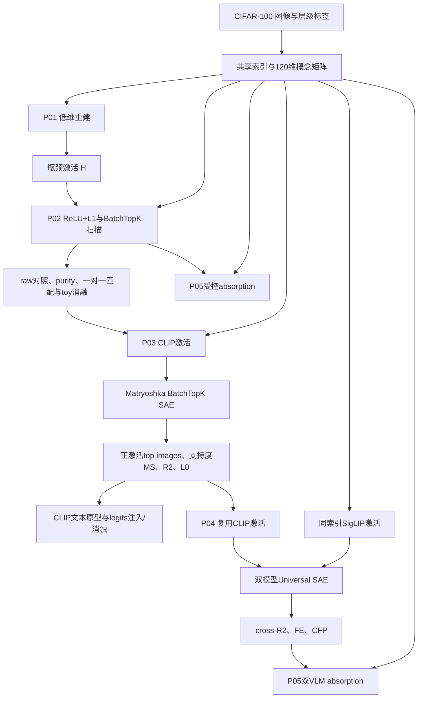

# SAE 项目目录与实验产物说明

本文档对应当前 `SAE/` 目录的实际状态，说明项目中每个文件的用途、主要代码链路，以及 `outputs/p01` 至 `outputs/p05` 五个已运行实验的产物和结果。除特别说明外，数组均为 NumPy `.npy`，检查点均为 PyTorch `.pt`。

本文档不展开 `.git/` 内部对象、`__pycache__/`、`.pytest_cache/` 等版本控制或运行缓存；这些内容不属于实验逻辑。当前五阶段结果均由服务器实际运行产生，`manifest.json` 中的标签为 `ADAPTED`，表示它们是在统一 CIFAR-100 设置上的机制适配实验，不是五篇论文原始规模和原始数值的严格复现。

## 1. 项目总链路

```text
CIFAR-100 原始批文件
  ↓ make prepare
固定 train/test 样本索引 + fine/coarse 标签 + 120 维概念矩阵
  ↓
P01：120 个已知概念压入 32 维瓶颈，观察 superposition
  ↓ train_hidden/test_hidden
P02：在 32 维瓶颈上训练 128 latent ReLU+L1 SAE
  ↓ SAE latent、decoder 和已知概念恢复结果
P03：提取 CLIP 512 维图像激活，训练 2048 latent Matryoshka BatchTopK SAE
  ↓ latent、top images、MS、重建和 probe 干预
P04：复用 CLIP 激活并提取 SigLIP 768 维激活，训练 512 latent Universal SAE
  ↓ 两模型共享索引、cross-reconstruction、FE、CFP
P05：用 CIFAR-100 coarse→fine 层级分析 P02/P04 的 splitting 与 absorption
```

五阶段通过 `data/shared/*_indices.npy` 和各阶段保存的 `sample_ids` 保证样本顺序一致。P04 不重新提取 CLIP，而是直接读取 P03 的标准化 CLIP 激活；P05 不再训练模型，只分析 P02 与 P04 的已有表示。

## 2. 根目录文件

| 文件 | 作用 |
|---|---|
| `目录.md` | 本文档；给出全项目文件说明和五阶段实际输出分析。 |
| `README.md` | 项目总体目标、五篇论文的串联方式、运行顺序、本地 Mac 可行性和结果标签定义。注意其中“尚未运行/NOT_RUN”的描述是初始骨架时期留下的，当前 `outputs/` 已有实际结果。 |
| `Makefile` | 统一命令入口。设置 `PYTHONPATH=src`，提供 `make analyze/check/prepare/p01/p02/p03/p04/p05/all`。 |
| `requirements.txt` | Python 依赖及版本范围，包括 NumPy、PyTorch、Transformers、Safetensors、Matplotlib、PyTest 等。 |
| `pytest.ini` | 让 PyTest 从 `src` 导入包，并只在 `tests/` 中发现测试。 |
| `.gitignore` | 忽略 Python 缓存、虚拟环境、原始/共享数据、实验输出、`models/` 以及 `.pt/.npy/.bin/.safetensors` 等大文件，防止误提交数据和模型权重。 |
| `.DS_Store` | macOS Finder 自动生成的目录显示元数据，对项目无作用，可忽略。 |

## 3. 配置文件 `configs/`

运行某阶段时，`core/config.py` 先读 `base.yaml`，再用对应 `pXX.yaml` 递归覆盖同名字段。最终合并配置会完整写入该阶段的 `manifest.json`。

| 文件 | 作用与当前关键值 |
|---|---|
| `configs/base.yaml` | 全阶段公共配置：随机种子 42、设备自动选择、float32、禁止绕过代码分析门禁；数据规模为 5,000 train + 1,000 test；定义 `data/shared` 和 `outputs` 路径。 |
| `configs/p01.yaml` | P01 参数：120→32 瓶颈、batch 256、1,200 steps、学习率 0.003；扫描噪声密度 0/0.02/0.05/0.10，并比较线性与 ReLU 输出。 |
| `configs/p02.yaml` | P02 参数：默认固定 4×宽度，扫描三种 L1 系数与 K=2/4/8 的 BatchTopK；用 20% train 数据验证，优先选择验证 R²≥0.95、L0≤8 的模型，并配置 raw/SAE 公平阈值和 purity 最低支持度。 |
| `configs/p03.yaml` | P03 参数：本地 CLIP 与独立 SigLIP 语义参考、K=16 Matryoshka SAE、MS 最低支持度16、子采样区间、只显示正激活 top images，以及正值95%分位数的 injection/ablation 和 CLIP zero-shot 剂量响应。 |
| `configs/p04.yaml` | P04 参数：Universal SAE 宽度/K/步数，以及语义对齐支持数、top-k、置换次数、bootstrap 和错配训练对照开关。 |
| `configs/p05.yaml` | P05 参数：discovery 比例、split/effect 阈值、child purity/lift/FDR、候选上限和匹配随机对照次数。 |

## 4. 数据目录 `data/`

### 4.1 数据说明文件

| 文件 | 作用 |
|---|---|
| `data/README.md` | 说明 `make prepare` 后应出现的 raw/shared 结构，以及五阶段必须共享索引的约束。 |

### 4.2 原始 CIFAR-100：`data/raw/cifar-100-python/`

CIFAR-100 的 Python 版本不是逐张图片文件，而是 pickle 批文件。每张 32×32 RGB 图片在批文件中以长度 3,072 的扁平数组保存。

| 文件 | 作用 |
|---|---|
| `train` | CIFAR-100 的 50,000 张训练图片、fine/coarse 标签及文件名，约 155 MB。Torchvision 从这里按 `train_indices.npy` 取出本项目的 5,000 张图片。 |
| `test` | CIFAR-100 的 10,000 张测试图片、fine/coarse 标签及文件名，约 31 MB。本项目选取其中 1,000 张。 |
| `meta` | 100 个 fine 类名和 20 个 coarse 类名等元数据。 |
| `file.txt~` | 0 字节的编辑器备份文件，对数据读取无作用，可忽略或清理。 |

### 4.3 五阶段共享数据：`data/shared/`

| 文件 | 形状/类型 | 作用 |
|---|---:|---|
| `manifest.json` | JSON | 记录 CIFAR-100、随机种子 42、100 个 fine 名称、20 个 coarse 名称、概念维度 120、训练/测试样本数和每图一个 fine + 一个 coarse 的关系。 |
| `train_indices.npy` | `[5000] int64` | 训练子集在 CIFAR-100 原始 50,000 张训练集中的行号；已排序，保证所有阶段读取顺序一致。 |
| `test_indices.npy` | `[1000] int64` | 测试子集在原始 10,000 张测试集中的行号。 |
| `train_fine.npy` | `[5000] int64` | 训练样本 fine label，取值 0–99。 |
| `test_fine.npy` | `[1000] int64` | 测试样本 fine label。 |
| `train_coarse.npy` | `[5000] int64` | 训练样本 coarse parent label，取值 0–19。 |
| `test_coarse.npy` | `[1000] int64` | 测试样本 coarse parent label。 |
| `train_concepts.npy` | `[5000,120] float32` | 前 100 维为 fine one-hot，后 20 维为 coarse one-hot；每行恰有两个 1。用于 P01/P02 ground truth 和 P03 MS 语义参考。 |
| `test_concepts.npy` | `[1000,120] float32` | 测试集对应的 120 维层级概念矩阵。 |

## 5. 本地模型目录 `models/`

模型目录是运行 P03/P04 的离线依赖，不属于训练输出。权重很大，不应提交 GitHub。

### 5.1 `models/google-siglip-base-patch16-224/`

| 文件 | 作用 |
|---|---|
| `config.json` | SigLIP 总配置，声明 `SiglipModel`、768 维文本/视觉隐藏层、视觉 patch size 16。`SiglipVisionModel.from_pretrained` 从其中读取视觉结构。 |
| `preprocessor_config.json` | SigLIP 图像预处理：缩放到 224×224、像素 rescale、均值/标准差均为 0.5。 |
| `model.safetensors` | SigLIP PyTorch Safetensors 权重，812,672,320 字节；P04 实际加载此文件并只使用视觉塔。 |
| `SHA256SUMS.txt` | 上述三个必要文件的 SHA-256，用于上传前后完整性校验。 |

### 5.2 `models/openai-clip-vit-base-patch32/`

| 文件 | 作用 |
|---|---|
| `.gitattributes` | 上游模型仓库的 Git LFS 文件规则，对离线 Transformers 加载无作用。 |
| `README.md` | 上游 CLIP 模型卡和使用说明。 |
| `SHA256SUMS.txt` | `config.json`、`preprocessor_config.json`、`pytorch_model.bin` 的校验值。 |
| `config.json` | CLIP 完整结构配置：ViT-B/32、视觉隐藏宽度 768、图像 224、投影维度 512；P03 最终提取 512 维 `image_embeds`。 |
| `configuration.json` | ModelScope 仓库元数据，声明 PyTorch 和 zero-shot image classification；Transformers 核心加载不依赖它。 |
| `preprocessor_config.json` | CLIP 图像缩放、中心裁剪和 RGB 均值/标准差。 |
| `pytorch_model.bin` | P03 实际使用的 PyTorch 权重，约 605 MB。 |
| `flax_model.msgpack` | 同一模型的 Flax/JAX 权重，约 605 MB；当前项目不使用。 |
| `tf_model.h5` | 同一模型的 TensorFlow 权重，约 606 MB；当前项目不使用。 |
| `merges.txt` | CLIP BPE tokenizer 合并规则；当前视觉-only P03 不使用。 |
| `vocab.json` | CLIP 文本 tokenizer 词表；当前视觉-only P03 不使用。 |
| `tokenizer.json` | 完整快速 tokenizer 序列化文件；当前视觉-only P03 不使用。 |
| `tokenizer_config.json` | tokenizer 行为配置；当前视觉-only P03 不使用。 |
| `special_tokens_map.json` | BOS/EOS/UNK/PAD 特殊 token 映射；当前视觉-only P03 不使用。 |

`flax_model.msgpack` 与 `tf_model.h5` 是重复框架权重，可以不上传服务器；保留它们只会增加约 1.2 GB 占用。

## 6. 运行前代码分析 `docs/code_structure/`

这些文件是实验门禁的一部分。只要 `allow_unreviewed_code=false`，缺少任意文件或 `CODE_ANALYSIS_DONE.yaml` 未标记 accepted，P01–P05 就会拒绝运行。

| 文件 | 作用 |
|---|---|
| `repository_tree.md` | 说明统一入口、模块职责、阶段产物连接和当前实现边界。 |
| `module_inventory.csv` | 按核心类/函数列出必要性、数学操作、输入、输出、上下游、替换风险和验证方式。 |
| `equation_code_map.csv` | 建立“论文公式或概念 → 代码位置 → 输出文件 → 测试”的映射。 |
| `call_graph.mmd` | Mermaid 流程图，表示 CIFAR 数据如何流经 P01–P05。 |
| `tensor_shapes.md` | 列出概念矩阵、P01 hidden、P02 latent、CLIP/SigLIP 激活、Universal latent、FE/CFP 等边界形状。 |
| `assumptions.yaml` | 明确五篇论文改写到 CIFAR-100 时的假设、代理指标和限制。 |
| `CODE_ANALYSIS_DONE.yaml` | 代码分析验收标记；当前状态为 accepted，日期 2026-08-31。 |

## 7. 独立实验入口 `experiments/`

这些 `run.py` 都是很薄的包装，只调用 `run_stage("pXX")`；核心实现仍在 `src/sae_repro/stages/`。

| 文件 | 作用 |
|---|---|
| `experiments/p01_toy_superposition/run.py` | 单独启动 P01。 |
| `experiments/p02_interpretable_sae/run.py` | 单独启动 P02。 |
| `experiments/p03_single_vlm/run.py` | 单独启动主体论文 P03。 |
| `experiments/p04_two_vlms/run.py` | 单独启动 P04。 |
| `experiments/p05_absorption/run.py` | 单独启动 P05。 |

## 8. 源码 `src/sae_repro/`

### 8.1 包入口

| 文件 | 作用 |
|---|---|
| `src/sae_repro/__init__.py` | 声明项目包和版本 `0.1.0`。 |
| `src/sae_repro/cli.py` | 命令行解析器；接受 `prepare/p01/p02/p03/p04/p05/all` 并转交 pipeline。 |

### 8.2 公共基础设施 `core/`

| 文件 | 作用 |
|---|---|
| `core/__init__.py` | 标记 core 子包。 |
| `core/artifacts.py` | 创建阶段输出目录、检查上游文件、读写 JSON/NumPy、写入含环境/配置/时间/输入来源的 manifest。 |
| `core/config.py` | 读取 YAML，并把阶段配置递归覆盖到 base 配置。 |
| `core/device.py` | 按 MPS→CUDA→CPU 选择设备，并在模型切换后释放设备缓存。 |
| `core/paths.py` | 计算项目根目录，把配置中的相对路径解析到项目根目录。 |
| `core/preflight.py` | 检查七个结构分析文件和 accepted 状态，实现“先分析代码，再运行实验”的硬门禁。 |
| `core/seed.py` | 同时固定 Python、NumPy、PyTorch、CUDA/MPS 随机种子。 |

### 8.3 数据 `data/`

| 文件 | 作用 |
|---|---|
| `data/__init__.py` | 标记共享数据子包。 |
| `data/concepts.py` | 定义 20 个 coarse→5 fine 的官方层级；生成 fine→coarse 映射和 120 维概念矩阵。 |
| `data/cifar100.py` | 下载/读取 CIFAR-100、固定抽样索引、保存 shared 数组；`IndexedCIFAR100` 按共享索引返回 PIL 图像、fine、coarse 和原始 sample id。 |

### 8.4 视觉模型 `models/`

| 文件 | 作用 |
|---|---|
| `models/__init__.py` | 标记视觉模型封装子包。 |
| `models/vision.py` | 根据 `model_kind` 加载 CLIP 或 SigLIP 图像处理器和视觉塔；按共享索引批量提取图像级激活，并保存激活与 sample id。CLIP 取 512 维 `image_embeds`，SigLIP 取 768 维 `pooler_output`。 |
| `models/clip_zero_shot.py` | 加载 CLIP 文本塔，用提示词集构造100个 fine class 文本原型；将 SAE 标准化空间还原后计算真实 CLIP 图文 logits。 |

### 8.5 SAE 模型与训练 `sae/`

| 文件 | 作用 |
|---|---|
| `sae/__init__.py` | 标记 SAE 子包。 |
| `sae/models.py` | 实现四种模型：`ReLUSAE`（L1 稀疏）、`BatchTopKSAE`（训练态全 batch 的 B×K 预算及推理阈值校准）、`MatryoshkaBatchTopKSAE`（多个 latent 前缀同时重建）、`UniversalSAE`（两个模型专属 encoder/decoder + 共享 TopK latent 索引）。 |
| `sae/trainer.py` | 通用 SAE 训练循环、无限 shuffle loader、分批编码/重建、BatchTopK 阈值校准，以及交替用 CLIP/SigLIP 作为源编码器训练 Universal SAE。 |

### 8.6 指标 `metrics/`

| 文件 | 作用 |
|---|---|
| `metrics/__init__.py` | 标记指标子包。 |
| `metrics/reconstruction.py` | 计算整体 R²、每样本平均非零 latent 数 L0、测试集从未激活的 dead latent 比例。 |
| `metrics/concepts.py` | 二分类 F1、concept→latent 映射、decoder 方向匹配，以及只返回正激活图片并用 `-1` 补空位的 top indices。 |
| `metrics/disentanglement.py` | P02 新增：验证集选单元/方向/阈值，测试集公平比较 raw neuron 与 SAE latent；计算 latent purity/entropy、Hungarian 一对一方向恢复和经 P01 decoder 的 latent 消融。 |
| `metrics/monosemanticity.py` | 按语义 embedding 的加权两两相似度计算 MS；新增正激活支持度过滤和无放回子采样稳定区间。 |
| `metrics/interventions.py` | P03 新增：只在正激活值中取 clamp，执行 latent injection、ablation、剂量响应和激活频率匹配对照，并评价 CLIP logits。 |
| `metrics/universality.py` | 计算 2×2 cross-reconstruction R²、打乱目标样本后的负对照 R²、两模型 firing entropy（FE）、co-fire proportion（CFP）和 decoder contribution energy。 |
| `metrics/cross_model_alignment.py` | P04 增强：逐 latent 计算激活 Pearson、firing/top-image Jaccard、fine/coarse 标签分布余弦和主标签一致率；生成样本/latent 置换零假设及 bootstrap 区间。 |
| `metrics/splitting.py` | P05 增强：在 discovery 确定 latent 顺序，再到留出数据计算并集 F1；首个 main latent 只作基线，不计入额外 splitting。 |
| `metrics/absorption_controls.py` | P05 增强：评价候选的 fine 子类 purity/lift、标签置换显著性与 FDR；执行 decoder 重建消融和 firing/norm/projection 匹配的随机候选对照。 |
| `metrics/absorption.py` | 为 coarse parent 建立均值差 probe；只在 discovery 选择 main/split/candidate，随后把固定规则迁移到 validation/test。 |

### 8.7 阶段编排 `stages/`

| 文件 | 作用 |
|---|---|
| `stages/__init__.py` | 标记五阶段子包。 |
| `stages/common.py` | 读取 shared 数组、只用训练统计量标准化 train/test、统一转 CPU float32 tensor、定位阶段输出目录。 |
| `stages/p01_superposition.py` | 训练 tied-weight toy reconstructor；扫描密度与输出非线性，计算表示特征数、方向干扰和 MSE；保存原始稀疏设置下 ReLU 模型的 32 维 hidden。 |
| `stages/p02_interpretable_sae.py` | 读取 P01 hidden，扫描 ReLU+L1/BatchTopK 候选并在验证集选模型；保存标准下游数组及 raw/SAE 对照、purity、一对一方向匹配和 toy 消融报告。 |
| `stages/p03_single_vlm.py` | 缓存/读取 CLIP 激活，训练 Matryoshka BatchTopK SAE；用独立 SigLIP 参考计算支持度过滤 MS，保存正激活图片，并执行 CLIP zero-shot logits 注入/消融。 |
| `stages/p04_universal_sae.py` | 训练正确配对及错配训练对照 Universal SAE；输出 cross-R²、FE/CFP、逐 latent 语义对齐、置换检验、bootstrap 和图表。 |
| `stages/p05_absorption.py` | 分别读取 P02 与 P04 的 train/test 表示；完成 discovery/validation/test 协议，输出候选审计表、真实 decoder 消融、匹配随机对照和图表。 |
| `stages/pipeline.py` | 固定 `prepare→p01→p02→p03→p04→p05` 顺序，或运行指定阶段。 |

### 8.8 可视化 `visualization/`

| 文件 | 作用 |
|---|---|
| `visualization/__init__.py` | 标记可视化子包。 |
| `visualization/top_images.py` | 从测试集读取每个 latent 的有效 top 行号；跳过 `-1` 和零激活填充，标题显示 fine、coarse、sample id、activation 和真实图片数。 |
| `visualization/interventions.py` | 重跑 P03 时汇总目标 latent 与匹配对照的剂量响应，并绘制逐 latent 消融后的目标 CLIP logit 变化。 |

## 9. 结构分析脚本与测试

| 文件 | 作用 |
|---|---|
| `scripts/analyze_structure.py` | `make analyze` 的实现；打印源码树和代码分析文档，提示人工阅读。 |
| `tests/test_concepts.py` | 验证概念矩阵形状为 `[N,120]`，且每行恰好一个 fine 和一个 coarse。 |
| `tests/test_sae.py` | 验证 ReLU SAE 形状与非负性、BatchTopK 的 B×K 预算、Matryoshka loss 为标量、Universal SAE 的共享 latent 和双 decoder 形状。 |
| `tests/test_ms.py` | 验证低内存 MS 与显式 N×N 两两公式数值等价，并检查极小支持 latent 会被过滤。 |
| `tests/test_disentanglement.py` | 验证 raw/SAE 单元映射能从验证集迁移到测试集，且 Hungarian 匹配不会复用 latent。 |
| `tests/test_interventions.py` | 验证正激活分位数忽略零值，以及 CLIP logits 会正确还原标准化 embedding。 |
| `tests/test_cross_model_alignment.py` | 验证相同 latent 的激活、top 图片和标签语义对齐，并检查置换对照与 bootstrap 接口。 |
| `tests/test_splitting.py` | 验证 main latent 只作基线，不会被误计为额外 splitting。 |
| `tests/test_absorption.py` | 构造 main latent 漏检、child latent 接管 parent 信息的 fixture，验证固定候选 decoder 消融与子类匹配。 |

## 10. 输出目录 `outputs/` 总览

| 文件/目录 | 作用 |
|---|---|
| `outputs/README.md` | 说明每阶段至少有 manifest、metrics 和下游所需数组/检查点，禁止创建伪造结果。 |
| `outputs/p01/` | Superposition toy model 的模型、32 维 hidden、feature directions 和扫描指标。 |
| `outputs/p02/` | 受控 ReLU SAE、128 维系数、decoder、概念恢复和方向匹配。 |
| `outputs/p03/` | CLIP 原始/标准化激活、2,048 维 SAE 系数、重建、MS、top images、干预和 checkpoint。 |
| `outputs/p04/` | 双模型激活和共享 latent、cross-R²、逐 latent 语义对齐、置换/错配训练对照、bootstrap、图表和 checkpoint。 |
| `outputs/p05/` | P02/P04 的 discovery、validation、test splitting/absorption 报告、候选 CSV、随机对照和图表。 |

每个 `manifest.json` 记录运行时间、完整配置、Python/平台/PyTorch 版本和上游 manifest。当前五个阶段均在 Linux、Python 3.11.16、PyTorch 2.13.0+cu130 环境产生，状态为 completed，标签为 ADAPTED。

## 11. P01 输出：superposition

### 11.1 输入、方法和文件

输入为 `train/test_concepts.npy` 的 120 个已知层级概念，模型把它们压缩到 32 维。只要被表示方向数大于 32 且方向之间存在非零干扰，就按本项目判据标记为 superposition。

| 文件 | 形状/内容 | 作用 |
|---|---:|---|
| `p01/manifest.json` | JSON | 记录 P01 配置和环境；无上游实验 manifest，因为数据由 prepare 产生。 |
| `p01/metrics.json` | 8 个实验设置 | 4 个噪声密度 × 线性/ReLU 输出的 loss、MSE、表示特征数、平均绝对方向干扰和 superposition 判定。 |
| `p01/toy_model.pt` | checkpoint | 被选中的 density=0、ReLU 输出模型。字段为 `state_dict/input_dim=120/hidden_dim=32/relu_output=true`；权重 `[32,120]`，偏置 `[120]`。 |
| `p01/train_hidden.npy` | `[5000,32] float32` | P01 训练样本瓶颈激活，是 P02 的直接训练输入。 |
| `p01/test_hidden.npy` | `[1000,32] float32` | P01 测试样本瓶颈激活，是 P02 测试输入。 |
| `p01/feature_directions.npy` | `[120,32] float32` | 每个已知概念在 32 维瓶颈中的真实方向，即 toy 模型权重的转置；P02 用它评价 decoder direction。 |

### 11.2 实际结果

| noise density | 线性 MSE | ReLU MSE | 线性干扰 | ReLU 干扰 | represented features |
|---:|---:|---:|---:|---:|---:|
| 0.00 | 0.005373 | 约 `9.07e-17` | 0.0802 | 0.1262 | 两者均 120 |
| 0.02 | 0.009762 | 0.001263 | 0.1224 | 0.1140 | 两者均 120 |
| 0.05 | 0.016395 | 0.005119 | 0.1271 | 0.1101 | 两者均 120 |
| 0.10 | 0.026374 | 0.013594 | 0.1276 | 0.1064 | 两者均 120 |

所有 8 个设置均满足 `120 represented features > 32 hidden dimensions` 且平均绝对干扰大于 `1e-3`，因此 `superposition_detected=true`。噪声密度上升时重建误差总体增大，ReLU 输出在本设置下优于线性输出。

这证明当前 toy 目标能在低维瓶颈中表示多于维度数的已知概念，但不是对真实 VLM superposition 的直接证明；P01 的任务结构非常规则，而且 density=0 的 ReLU 模型几乎精确重建。

## 12. P02 输出：SAE 从已知叠加中恢复 feature

### 12.1 文件说明

| 文件 | 形状/内容 | 作用 |
|---|---:|---|
| `p02/manifest.json` | JSON | 记录配置，并把 P01 manifest 作为上游输入。 |
| `p02/metrics.json` | JSON | 汇总所选候选、R²/L0/dead latent、raw-vs-SAE 对照、purity、一对一方向匹配和兼容旧流程的 concept mapping。 |
| `p02/sae.pt` | checkpoint | 重跑后保存验证阶段所选的 ReLU+L1 或 BatchTopK SAE，并记录 `model_type`、input/latent/expansion 及对应稀疏参数。 |
| `p02/train_activations.npy` | `[5000,32]` | P01 `train_hidden` 的阶段内副本；P05 受控分析读取它。 |
| `p02/test_activations.npy` | `[1000,32]` | P01 `test_hidden` 的阶段内副本。 |
| `p02/train_latents.npy` | `[5000,w]` | 所选模型的非负 SAE 系数；默认候选宽度 `w=128`，P05 受控 absorption 读取它。 |
| `p02/test_latents.npy` | `[1000,w]` | 测试样本 SAE 系数，用于概念 F1、R²/L0/dead latent。 |
| `p02/decoder_directions.npy` | `[w,32]` | 每个 SAE latent 在 P01 hidden 空间的单位 decoder direction；P05 读取它。 |
| `p02/direction_match.npy` | `[120]` | 每个已知 ground-truth feature direction 与 128 个 SAE decoder 中最大 cosine 相似度。 |
| `p02/sweep_metrics.json` | JSON | 重跑新增；保存每个 ReLU+L1/BatchTopK 候选的验证 R²、L0、dead、概念 F1、方向匹配和训练历史。 |
| `p02/interpretability_comparison.json` | JSON | 重跑新增；保存同一验证阈值协议下 raw neuron 与 SAE latent 的独立测试集映射和汇总。 |
| `p02/disentanglement_metrics.json` | JSON | 重跑新增；保存 latent-centered purity/entropy 和 Hungarian 一对一 decoder 匹配。 |
| `p02/toy_interventions.json` | JSON | 重跑新增；消融单 latent 后，经 P01 decoder 测量目标概念输出下降与无关概念变化。 |

### 12.2 旧版实际结果与重跑要求

以下数值来自增强代码写入前的旧版单一 ReLU+L1 运行，只能作为问题基线。执行新版 `make p02` 后，应以新生成的四个评价 JSON 和新的 `metrics.json` 为准。

- 测试 R²：`0.9999966`，说明几乎完整重建 P01 hidden。
- 测试 L0：`61.907/128`，平均每个样本约 62 个 latent 激活，表示当前 L1 系数下系数并不稀疏。
- dead latent fraction：`0.0`，所有 128 个 latent 都在测试集激活过。
- 120 个已知概念的最佳单 latent F1：均值 `0.2041`、中位数 `0.1570`、最大 `0.6441`。
- ground-truth direction 最大 cosine 匹配：均值 `0.4554`，范围约 `0.3039–0.7926`。
- 训练 reconstruction loss 从 `0.02875` 降到约 `2.28e-7`。

最佳五个概念映射为：fine `fox`→latent 67，F1 `0.6441`；coarse `medium_sized_mammals`→latent 67，F1 `0.6250`；coarse `trees`→latent 76，F1 `0.5682`；coarse `fruit_and_vegetables`→latent 0，F1 `0.5510`；coarse `food_containers`→latent 40，F1 `0.4677`。

因此 P02 明确实现了“SAE 重建和字典方向恢复”的方法链，但当前结果更强地支持高保真重建，单义概念恢复只属中等水平；高 R² 不能被单独解释为高可解释性。

## 13. P03 输出：单个 CLIP VLM 的 SAE 单义链路

### 13.1 文件说明

| 文件 | 形状/内容 | 作用 |
|---|---:|---|
| `p03/manifest.json` | JSON | 记录本地 CLIP 路径、SAE 配置、环境和 P02 上游 manifest。 |
| `p03/metrics.json` | JSON | 重跑后汇总 R²/L0/dead、MS coverage、独立语义来源、子采样区间、CLIP zero-shot 重建保真度及干预摘要。 |
| `p03/train_clip_raw.npy` | `[5000,512]` | CLIP `image_embeds` 原始训练激活；网络/模型不可用时可直接复用缓存。 |
| `p03/test_clip_raw.npy` | `[1000,512]` | CLIP 原始测试激活。 |
| `p03/train_sample_ids.npy` | `[5000] int64` | CLIP 训练激活对应的原始 CIFAR 行号；必须等于 shared train indices。 |
| `p03/test_sample_ids.npy` | `[1000] int64` | CLIP 测试激活对应的原始 CIFAR 行号。 |
| `p03/activation_mean.npy` | `[1,512]` | 仅由训练原始激活计算的逐维均值。 |
| `p03/activation_std.npy` | `[1,512]` | 仅由训练原始激活计算的逐维标准差。 |
| `p03/train_activations.npy` | `[5000,512]` | 标准化后的 CLIP 训练激活；P03 SAE 输入，也是 P04/P05 的 CLIP 表示。 |
| `p03/test_activations.npy` | `[1000,512]` | 标准化后的 CLIP 测试激活。 |
| `p03/clip_sae.pt` | checkpoint | 512→2,048→512 Matryoshka BatchTopK SAE；含 center、2,048 个推理阈值、encoder/decoder，K=16 和四个前缀比例。 |
| `p03/train_latents.npy` | `[5000,2048]` | 训练样本 SAE 系数。 |
| `p03/test_latents.npy` | `[1000,2048]` | 测试样本 SAE 系数。 |
| `p03/train_reconstruction.npy` | `[5000,512]` | 从训练 SAE 系数解码的标准化 CLIP 激活。 |
| `p03/test_reconstruction.npy` | `[1000,512]` | 测试重建，用于 R² 和 probe 干预基线。 |
| `p03/decoder_directions.npy` | `[2048,512]` | 每个 latent 在标准化 CLIP 激活空间的 decoder direction。 |
| `p03/ms_latent.npy` | `[w]` | 未做支持度过滤的原始 MS，保留用于审计。 |
| `p03/ms_latent_supported.npy` | `[w]` | 重跑新增；正激活数不足16的 latent 被标记为 NaN，是可视化和干预的候选分数。 |
| `p03/ms_support_counts.npy` | `[w]` | 重跑新增；每个 latent 的测试集正激活样本数。 |
| `p03/ms_raw.npy` | `[512]` | 512 个原始标准化 CLIP neuron 的同协议 MS，全部有限。 |
| `p03/top_image_rows.npy` | `[w,16] int64` | 每个 latent 的正激活 top 行号，不足处为 `-1`；数组存测试子集行号而不是原始 CIFAR id。 |
| `p03/top_positive_counts.npy` | `[w]` | 重跑新增；top-16 中实际正激活图片数量。 |
| `p03/test_semantic_reference_raw.npy` | `[1000,768]` | 重跑新增；默认由独立 SigLIP 提取，用于 MS 图片语义相似度。 |
| `p03/test_semantic_reference_sample_ids.npy` | `[1000]` | 独立语义参考的样本 id 对齐证据。 |
| `p03/clip_text_prototypes.npy` | `[100,512]` | 重跑新增；CLIP 文本塔对提示词集求平均得到的 fine-class 原型。 |
| `p03/intervention_results.json` | JSON | 重跑新增；记录非零正激活 clamp、injection/ablation、三档剂量、匹配频率对照和 CLIP logit 变化。 |
| `p03/intervention_plots/dose_response.png` | PNG | 重跑新增；目标 latent 与匹配对照 latent 的平均剂量响应。 |
| `p03/intervention_plots/ablation_effects.png` | PNG | 重跑新增；最多20个候选 latent 的目标类别消融效果。 |

### 13.2 旧版 `top_image_grids/` 与新版 `top_positive_image_grids/`

现有 `top_image_grids/` 是旧版结果；新版 `make p03` 会写入 `top_positive_image_grids/`，只显示支持度至少16且真正正激活的图片，并在标题中写出 activation。

每个 PNG 为 1,200×1,200 RGBA、4×4 图像网格：

`latent_00025.png`、`latent_00041.png`、`latent_00079.png`、`latent_00267.png`、`latent_00299.png`、`latent_00343.png`、`latent_00370.png`、`latent_00502.png`、`latent_00528.png`、`latent_00671.png`、`latent_01019.png`、`latent_01238.png`。

这 12 个文件分别可视化 MS 最高的 12 个有限 latent。实际正激活支持度如下：

| latent | MS | 测试集正激活数 | 正激活样本主 fine 概念 | 纯度 |
|---:|---:|---:|---|---:|
| 25 | 约 1.0 | 11 | motorcycle | 1.0 |
| 41 | 约 1.0 | 7 | castle | 1.0 |
| 79 | 约 1.0 | 7 | bicycle | 1.0 |
| 267 | 约 1.0 | 3 | castle | 1.0 |
| 299 | 约 1.0 | 5 | elephant | 1.0 |
| 343 | 约 1.0 | 3 | skyscraper | 1.0 |
| 370 | 约 1.0 | 3 | bus | 1.0 |
| 502 | 约 1.0 | 4 | table | 1.0 |
| 528 | 约 1.0 | 2 | bus | 1.0 |
| 671 | 约 1.0 | 3 | aquarium_fish | 1.0 |
| 1019 | 约 1.0 | 2 | can | 1.0 |
| 1238 | 约 1.0 | 3 | snail | 1.0 |

由于这些 latent 的正激活数小于 16，网格后半部分是从大量零激活并列样本中任意选出的填充图，不应解释为该 latent 的概念证据。例如 latent 25 的前 11 张正激活图均为 motorcycle，剩余 5 张不是；latent 1019 只有前 2 张为正激活。高 MS 在这里同时受到极小支持集影响，不能只看分数 1.0 就断言获得了稳健单义特征。

### 13.3 旧版实际定量结果

- 训练 Matryoshka loss 从 `0.9383` 降至 `0.2458`，full reconstruction loss 最终约 `0.1558`。
- 测试 R²：`0.4900`，说明 SAE 保留约一半相对于均值基线的激活方差。
- 测试 L0：`12.841`；目标 K 为 16，推理阈值校准后平均非零数略低于 16。
- dead latent fraction：`0.7002`，即约 1,434/2,048 latent 在测试集从未激活。
- SAE latent 的有限 MS 均值 `0.33384`、最大约 `1.0`；原始 CLIP neuron MS 均值 `0.03034`、最大 `0.03215`。
- 1,582 个 latent MS 为 NaN：既包括完全 dead/常数列，也包括激活支持不足以形成有效样本对的列。

表面上 latent MS 明显高于 raw neuron，但高 dead ratio 和极小正激活支持集会抬高“纯度”并降低 coverage，因此当前结果支持“部分 SAE latent 对特定标签更纯”，不支持“字典整体实现稳定、广覆盖的单义分解”。

### 13.4 因果干预的实际状态

`metrics.json` 保存了 32 个高 MS latent 的正向钳制实验，但本次运行的 32 个 `clamp_value` 全部为 `0.0`。原因是每个候选 latent 在 95% 训练分位数上仍为零；代码执行 `max(original, 0)` 后没有实质改变 latent。对应 probe logit delta 仅在约 `-1.30e-9` 到 `2.06e-9` 之间，是数值误差量级。

因此旧版 P03 已完成：视觉激活提取 → SAE 系数 → latent 可视化 → MS 定量；但“概念因果干预”在这次结果中退化，不能作为因果证据。增强代码现已改为正激活分位数、injection/ablation、剂量响应、匹配对照和 CLIP zero-shot logits；必须重新执行 `make p03` 后才能评价新因果结果。

## 14. P04 输出：CLIP 与 SigLIP 的 Universal SAE

### 14.1 文件说明

| 文件 | 形状/内容 | 作用 |
|---|---:|---|
| `p04/manifest.json` | JSON | 记录 SigLIP 本地路径、Universal SAE 配置和 P03 上游 manifest。 |
| `p04/metrics.json` | JSON | 保存 `cross_reconstruction_r2`（2×2 cross-R²）、平均 FE/CFP/energy、训练日志和语义边界。 |
| `p04/train_clip_activations.npy` | `[5000,512]` | P03 标准化 CLIP 训练激活的副本。 |
| `p04/test_clip_activations.npy` | `[1000,512]` | P03 标准化 CLIP 测试激活的副本。 |
| `p04/train_siglip_raw.npy` | `[5000,768]` | 同一训练样本的 SigLIP pooled 原始激活缓存。 |
| `p04/test_siglip_raw.npy` | `[1000,768]` | 同一测试样本的 SigLIP 原始激活缓存。 |
| `p04/train_siglip_sample_ids.npy` | `[5000] int64` | SigLIP 训练激活的原始 CIFAR id，用于与 CLIP/shared indices 三方比对。 |
| `p04/test_siglip_sample_ids.npy` | `[1000] int64` | SigLIP 测试激活的原始 CIFAR id。 |
| `p04/siglip_mean.npy` | `[1,768]` | SigLIP 训练原始激活均值。 |
| `p04/siglip_std.npy` | `[1,768]` | SigLIP 训练原始激活标准差。 |
| `p04/train_siglip_activations.npy` | `[5000,768]` | 标准化 SigLIP 训练激活。 |
| `p04/test_siglip_activations.npy` | `[1000,768]` | 标准化 SigLIP 测试激活。 |
| `p04/train_latents_clip.npy` | `[5000,512]` | 用 CLIP encoder 得到的共享索引空间系数。 |
| `p04/test_latents_clip.npy` | `[1000,512]` | 测试 CLIP shared latent。 |
| `p04/train_latents_siglip.npy` | `[5000,512]` | 用 SigLIP encoder 得到的共享索引空间系数。 |
| `p04/test_latents_siglip.npy` | `[1000,512]` | 测试 SigLIP shared latent。 |
| `p04/decoder_clip.npy` | `[512,512]` | 512 个共享索引在 CLIP 激活空间中的 decoder directions；P05 使用。 |
| `p04/decoder_siglip.npy` | `[512,768]` | 同一共享索引在 SigLIP 激活空间中的 decoder directions。 |
| `p04/firing_entropy.npy` | `[512]` | 每个共享 latent 在 CLIP/SigLIP 两侧 firing counts 的归一化熵；510 个有限值、2 个双方都不激活的 NaN。 |
| `p04/cofire_proportion.npy` | `[2,512]` | 第 0 行为 cofire/CLIP firing，第 1 行为 cofire/SigLIP firing。 |
| `p04/universal_sae.pt` | checkpoint | 两个 encoder `[512→512,768→512]`、两个 decoder `[512→512,512→768]`，共享 latent 512、K=16。 |
| `p04/latent_alignment.json` | JSON | 增强版逐 latent 支持数、激活相关、firing/top-image Jaccard、fine/coarse 标签纯度、分布余弦和主标签一致率。 |
| `p04/latent_alignment.csv` | CSV | 与上一文件相同的逐 latent 审计表，便于排序、筛选和制作论文表格。 |
| `p04/universality_controls.json` | JSON | 样本置换、latent 索引置换、打乱目标重构和错配训练 Universal SAE 的负对照结果。 |
| `p04/shuffled_pair_train_permutation.npy` | `[5000]` | 错配训练对照使用的 SigLIP 行置换，保证实验可复查。 |
| `p04/shuffled_target_test_permutation.npy` | `[1000]` | 计算打乱目标 cross-reconstruction 时使用的测试行置换。 |
| `p04/shuffled_pair_latent_alignment.json` | JSON | 错配训练模型在正确配对 test 上的逐 latent 对齐结果。 |
| `p04/alignment_plots/*.png` | PNG | 激活相关—标签分布相似度散点图，以及观察值与置换零假设对比图。 |
| `p04/universal_sae_shuffled_control.pt` | 可选 checkpoint | 仅当 `save_control_checkpoint=true` 时保存；默认不保存以减少磁盘占用。 |

### 14.2 实际结果

cross-reconstruction 的行表示源 encoder，列表示目标 decoder：

| source \ target | CLIP decoder | SigLIP decoder |
|---|---:|---:|
| CLIP encoder | 0.5909 | 0.3890 |
| SigLIP encoder | 0.3991 | 0.5274 |

同模型重建 R² 高于跨模型重建，但两条跨模型路径仍为正，说明共享 code 中保留了可由另一模型 decoder 使用的信息。其他结果：

- 平均 firing entropy：`0.6365`，表示活跃 latent 在两模型间具有中等而非完全均匀的 firing 分布。
- mean CFP：CLIP `0.2915`，SigLIP `0.2989`；约 29% 的单侧 firing 在同一样本另一模型中共同出现。
- mean concept energy：CLIP `0.02183`，SigLIP `0.02219`，两侧平均贡献能量接近。
- 训练 loss 从 `1.6097` 降至末步 `1.0108`。训练实际按奇偶 step 交替两个源模型；由于日志每 100 步记录一次，而 100 是偶数，日志中除最终 step 2499 外几乎都显示 source 0，这只是日志采样偏差，不代表只训练了 CLIP。

这些旧结果支持“两个模型可通过共同训练形成部分可跨解码的共享 code”，但共享索引和中等 CFP 不能独立证明每个同编号 latent 具有相同自然语言语义。

增强代码已加入逐 latent 的双模型标签语义对齐、top 图片重合、bootstrap、样本/latent 置换，以及同结构同训练步数的错误图片配对训练对照。执行新版 `make p04` 后，只有正确配对模型同时显著优于这些负对照，才能把结果升级为跨模型共享语义证据。本节现有数值来自旧版输出，不能提前当成增强实验结果。

## 15. P05 输出：feature splitting 与 absorption

### 15.1 文件和指标字段

| 文件 | 作用 |
|---|---|
| `p05/manifest.json` | 记录 P05 阈值、环境，并把 P02 与 P04 manifest 都列为上游输入。 |
| `p05/metrics.json` | 汇总两个来源的 discovery/validation/test 结果、平均 absorption rate 和解释边界。 |
| `p05/controlled_p02.json` | P02 受控表示的完整发现集候选、验证集诊断、测试集消融和随机对照。 |
| `p05/universal_clip_p04.json` | P04 CLIP 分支的同协议完整报告。 |
| `p05/candidate_latents.csv` | 所有通过基础 projection/support/effect 筛查的候选；含 child purity/lift、置换 p、FDR q、最终是否入选。 |
| `p05/discovery_indices.npy` / `validation_indices.npy` | 保存训练集内部的分层切分行号；两个来源必须共用同一切分。 |
| `p05/plots/*_absorption_vs_null.png` | 各 coarse parent 的测试 absorption rate 与匹配随机候选均值。 |
| `p05/plots/*_splitting_curves.png` | 按 discovery 固定顺序加入 latent 后的独立测试集并集 F1 曲线。 |

增强版每个 parent 报告的主要字段：

- `discovery.main_latent/main_latent_f1`：只在训练 discovery 子集选择的主 latent。
- `splitting.latent_order/union_f1_curve`：顺序在 discovery 固定，曲线分别在 validation/test 计算。
- `additional_splitting_count`：不再计入第一个 main latent，只统计后续并集 F1 增益超过 0.03 的次数。
- `false_negative_count`：parent 为真、main latent 不 firing 的样本数。
- `candidate_ids`：由 discovery 的 false-negative coverage、decoder effect 和 fine 子类特异性共同确定，test 阶段禁止重新选择。
- `absorption_count`：把固定候选同时置零、重新做 decoder 重建后，parent probe 下降超过阈值的测试 recall holes。
- `absorption_rate_over_tested_false_negatives` 与 `absorption_rate_over_parent_positives`：分别回答“漏检中多少被接管”和“全部父类样本中占多少”。
- `matching_child_rate_over_absorbed`：被判定 absorbed 的样本中，实际 fine 标签与活跃候选主子类一致的比例。
- `matched_random_control`：与候选匹配 firing rate、decoder norm 和 parent projection 的随机 latent 零假设及经验 p 值。

### 15.2 旧版总体结果

| 来源 | parent 数 | splitting_count 总和 | 额外 split 跳升 | false negatives | absorbed | mean absorption rate |
|---|---:|---:|---:|---:|---:|---:|
| P02 controlled SAE | 20 | 20 | 0 | 974 | 974 | 0.1954 |
| P04 Universal SAE 的 CLIP 分支 | 20 | 25 | 5 | 1,988 | 1,987 | 0.3985 |

P02 的 20 次 splitting 全是每个 parent 的第一次主 latent 跳升，没有任何 `splitting_count>1`，因此这次受控结果没有提供额外多-latent splitting 的证据。P04 中 food_containers、large_man_made_outdoor_things、people 为 2，vehicles_2 为 3，共有 5 次额外跳升，说明四个 parent 存在多 latent 改善并集覆盖的现象。

P02 有 recall hole 的 12 个 parent 中，每个被测试 false negative 都满足 absorption 代理阈值；P04 则是 1,988 个中的 1,987 个。如此接近 100% 的条件命中率说明当前 decoder-probe 代理相当宽松，平均吸收率主要还受主 latent recall hole 大小影响。它可以作为候选筛选，但不能直接表述为论文意义上的完整 feature absorption 因果证明。

以上数值是增强前的旧算法结果。新版已经修正首次 F1 跳升计数，并禁止逐测试样本挑选最佳候选；运行后必须以新增的两个来源 JSON、候选 CSV 和匹配随机对照为准。新算法可能得到更低甚至为零的 absorption rate，这属于更严格证据标准下的有效结果，而不是运行失败。

### 15.3 P02 受控 SAE 的逐 parent 结果

“top candidate”只显示 `candidate_latent_counts` 中出现最多的 latent 及次数；完整分布保存在 `metrics.json`。

| ID | coarse parent | main latent | main F1 | split count | FN | absorbed | rate | mean effect | top candidate |
|---:|---|---:|---:|---:|---:|---:|---:|---:|---|
| 0 | aquatic_mammals | 34 | 0.348 | 1 | 0 | 0 | 0.000 | 0.000 | – |
| 1 | fish | 45 | 0.359 | 1 | 0 | 0 | 0.000 | 0.000 | – |
| 2 | flowers | 6 | 0.312 | 1 | 97 | 97 | 0.391 | 0.210 | 70 (97) |
| 3 | food_containers | 40 | 0.442 | 1 | 63 | 63 | 0.229 | 0.148 | 1 (63) |
| 4 | fruit_and_vegetables | 0 | 0.559 | 1 | 0 | 0 | 0.000 | 0.000 | – |
| 5 | household_electrical_devices | 124 | 0.485 | 1 | 47 | 47 | 0.199 | 0.147 | 65 (47) |
| 6 | household_furniture | 26 | 0.398 | 1 | 0 | 0 | 0.000 | 0.000 | – |
| 7 | insects | 115 | 0.420 | 1 | 0 | 0 | 0.000 | 0.000 | – |
| 8 | large_carnivores | 107 | 0.452 | 1 | 0 | 0 | 0.000 | 0.000 | – |
| 9 | large_man_made_outdoor_things | 78 | 0.270 | 1 | 62 | 62 | 0.219 | 0.160 | 109 (62) |
| 10 | large_natural_outdoor_scenes | 11 | 0.423 | 1 | 86 | 86 | 0.350 | 0.170 | 72 (45) |
| 11 | large_omnivores_and_herbivores | 40 | 0.280 | 1 | 89 | 89 | 0.414 | 0.136 | 108 (49) |
| 12 | medium_sized_mammals | 67 | 0.500 | 1 | 151 | 151 | 0.597 | 0.203 | 117 (151) |
| 13 | non_insect_invertebrates | 112 | 0.391 | 1 | 55 | 55 | 0.227 | 0.241 | 90 (55) |
| 14 | people | 43 | 0.384 | 1 | 42 | 42 | 0.163 | 0.206 | 64 (42) |
| 15 | reptiles | 29 | 0.377 | 1 | 0 | 0 | 0.000 | 0.000 | – |
| 16 | small_mammals | 11 | 0.408 | 1 | 93 | 93 | 0.375 | 0.175 | 95 (48) |
| 17 | trees | 76 | 0.617 | 1 | 97 | 97 | 0.367 | 0.099 | 94 (97) |
| 18 | vehicles_1 | 124 | 0.386 | 1 | 92 | 92 | 0.377 | 0.207 | 44 (92) |
| 19 | vehicles_2 | 33 | 0.312 | 1 | 0 | 0 | 0.000 | 0.000 | – |

### 15.4 P04 Universal SAE 的 CLIP 分支逐 parent 结果

| ID | coarse parent | main latent | main F1 | split count | FN | absorbed | rate | mean effect | top candidate |
|---:|---|---:|---:|---:|---:|---:|---:|---:|---|
| 0 | aquatic_mammals | 33 | 0.500 | 1 | 110 | 110 | 0.458 | 1.736 | 376 (33) |
| 1 | fish | 254 | 0.558 | 1 | 92 | 91 | 0.374 | 2.005 | 376 (40) |
| 2 | flowers | 277 | 0.786 | 1 | 19 | 19 | 0.077 | 2.200 | 458 (7) |
| 3 | food_containers | 319 | 0.490 | 2 | 151 | 151 | 0.549 | 2.188 | 56 (42) |
| 4 | fruit_and_vegetables | 246 | 0.684 | 1 | 55 | 55 | 0.217 | 1.383 | 242 (26) |
| 5 | household_electrical_devices | 187 | 0.487 | 1 | 131 | 131 | 0.555 | 2.754 | 191 (36) |
| 6 | household_furniture | 117 | 0.681 | 1 | 59 | 59 | 0.235 | 3.378 | 452 (36) |
| 7 | insects | 252 | 0.596 | 1 | 116 | 116 | 0.433 | 1.827 | 316 (34) |
| 8 | large_carnivores | 265 | 0.522 | 1 | 70 | 70 | 0.266 | 1.811 | 404 (15) |
| 9 | large_man_made_outdoor_things | 188 | 0.434 | 2 | 183 | 183 | 0.647 | 2.197 | 368 (46) |
| 10 | large_natural_outdoor_scenes | 375 | 0.586 | 1 | 57 | 57 | 0.232 | 2.199 | 424 (22) |
| 11 | large_omnivores_and_herbivores | 7 | 0.514 | 1 | 123 | 123 | 0.572 | 3.015 | 297 (47) |
| 12 | medium_sized_mammals | 288 | 0.404 | 1 | 139 | 139 | 0.549 | 1.791 | 398 (59) |
| 13 | non_insect_invertebrates | 454 | 0.390 | 1 | 144 | 144 | 0.595 | 1.667 | 479 (33) |
| 14 | people | 231 | 0.684 | 2 | 90 | 90 | 0.349 | 2.916 | 4 (45) |
| 15 | reptiles | 235 | 0.420 | 1 | 109 | 109 | 0.452 | 1.849 | 132 (26) |
| 16 | small_mammals | 307 | 0.482 | 1 | 105 | 105 | 0.423 | 1.903 | 398 (42) |
| 17 | trees | 154 | 0.742 | 1 | 29 | 29 | 0.110 | 2.034 | 448 (10) |
| 18 | vehicles_1 | 346 | 0.695 | 1 | 97 | 97 | 0.398 | 2.855 | 504 (51) |
| 19 | vehicles_2 | 504 | 0.483 | 3 | 109 | 109 | 0.478 | 2.927 | 146 (33) |

## 16. 五篇论文核心论证链的当前完成度

下表描述的是磁盘中现有旧版 outputs；增强后的 P02/P03 代码尚未产生正式训练结果，不得把代码改动写成已复现实验结论。

| 阶段 | 已实现并有实际输出 | 当前不能宣称的内容 |
|---|---|---|
| P01 | 已知 120 features 在 32 维空间被表示，方向有干扰；完成 toy superposition 适配。 | 不能推出真实 VLM 内部必然以相同方式 superpose。 |
| P02 | 旧版 checkpoint、系数、decoder、重建、概念 F1 和 direction match 已产出；新版已加入模型扫描和完整对照代码。 | 必须重跑确认新版是否同时达到高 R²、低 L0 和优于 raw neuron，不能根据代码设计预先宣称成功。 |
| P03 | 旧版 CLIP 激活→SAE→top images→MS 已跑通；新版已修复支持度与非零干预逻辑。 | 必须重跑后检查 CLIP logits 的方向性、剂量响应和对照差距；仍未复现 LLaVA 生成干预。 |
| P04 | 旧版双模型激活、共享 latent、cross-R²、FE/CFP 已跑通；新版已加入逐 latent 语义对齐和三类负对照代码。 | 必须重跑并确认正确配对显著优于置换/错配训练，不能只凭共享索引宣称 universality。 |
| P05 | 旧版宽松代理有输出；新版已加入 discovery/validation/test、child specificity、FDR、固定候选重建消融和匹配随机对照。 | 必须重跑后才能报告严格 absorption；SAE parent probe 因果仍不是 VLM 生成行为因果。 |

## 17. 产物复用与清理注意事项

- P03/P04 首次激活提取完成后，会优先复用 `*_raw.npy + *_sample_ids.npy`；更换模型权重、预处理器或数据索引时必须同步清理旧缓存，否则会沿用旧激活。
- `outputs/` 和 `data/shared/` 已被 `.gitignore` 忽略，适合在服务器和本地之间通过 rsync 同步，不应提交 GitHub。
- `models/` 已由 `.gitignore` 忽略；提交前仍应使用 `git status` 检查是否有曾被 Git 跟踪的大权重文件。
- 任何论文结果汇报应同时引用该阶段 `manifest.json` 和 `metrics.json`，并将这里的结果标为 ADAPTED。
- 若修改核心张量边界、SAE 定义或阶段连接，应更新 `docs/code_structure/` 并重新确认 `CODE_ANALYSIS_DONE.yaml`，再运行实验。



